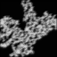
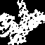
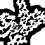
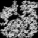
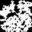
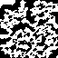
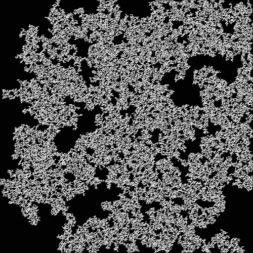
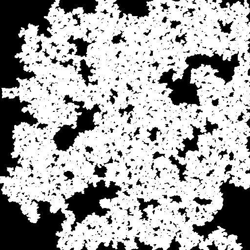
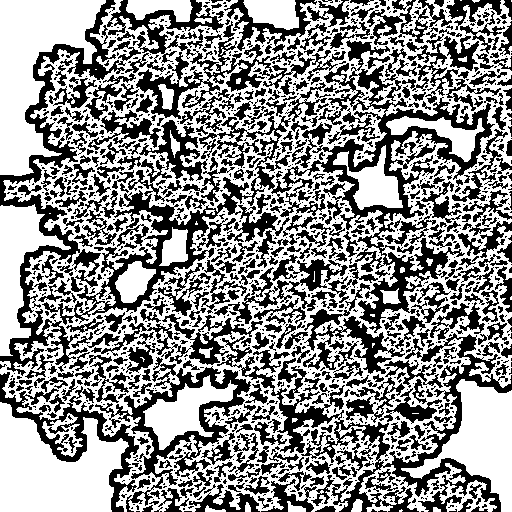

# CaveGen - A CLI Noisemap Cave Generator 
##### Current version: 0.1a (pre-alpha)
___

## About
*CaveGen* uses a pseudo-randomized, Perlin noise generated, monochrome noisemaps and a box-blur convolution kernel, which are being pulled through an OpenCV binary threshold algorithm. For examples, see below. The carving is implemented through matrix' depth-first search, always starting from the cave's center coordinates.

___

## Installation
CaveGen can be built from source using either `g++` or `cl`. As of pre-alpha, CaveGen is **platform-independent**, meaning it can be built both on Windows and other UNIX-like systems. Future plans include an implementation of `Windows' API`. Minimum required C++ standard is `C++20`.

*Last revision: 0.1a*

### Compiling using MSVC (cl)

In order to compile without linking, run: `cl /EHsc /c /std:c++20 *.cpp`  . After the compilation process finished successfully, run: `cl *.obj /out:{filename}` to link compiled object files, where `filename` is the linked output (executable) file.

*Note: If using Visual Studio Code as your preferred IDE, remember that it needs to be launched using 
`Windows' Developer Command Prompt for VS`, in order to acknowledge the included Windows API libraries, and for the `cl` run command to be recognized.*

### Compiling using GCC (g++)

Compiling via the GNU's Conpiler Collection is fairly straightforward - simply run `g++ *.cpp -o {filename}`, and you should be presented with a working, aptly-named executable file.

___

## Usage

Since CaveGen is presented via a **CLI narrative**, most of your processing will be done through the command line. There are primitively-supported program parameters:  
* `width`  :  *integer*, width-dimension in pixels of the resulting cave image
* `height` :  *integer*, height-dimension in pixels of the resulting cave image
* `carving-threshold`  :  *float*, minimum value of the (x, y) coordinates on the noisemap for the carving algorithm

The program can be invoked with the following syntax: 

&nbsp;&nbsp;&nbsp;&nbsp;&nbsp;&nbsp;&nbsp;`cavegen.exe [width] [height] [carving-threshold]`

Both width and height are interchangeable, meaning you can generate a square matrix providing only one of the width or height arguments: `cavegen [length] [carving-threshold]`, but the carving threshold can **not** be left out.

As a result of your pseudo-random luck, you will be presented with `original_cave.bmp` bitmap, located within the `./examples/` folder. If you are not satisfied with the result, and depending whether the original output was box-blurred (or not), you can run the `thresholding.py` program (*Usage: see below*), to generate a more natural, 2D cave system.

To use the Python thresholding module, make sure you have installed the prerequisites, listed within the `requirements.txt` file, using the `pip install -r requirements.txt` command. After the installation has been successful, you can run the Python file using the following syntax:  

&nbsp;&nbsp;&nbsp;&nbsp;&nbsp;&nbsp;&nbsp;`python thresholding.py --filename [string] --lower [int, 0-255] --upper [int, lower-255]`  

which will produce two resulting images in the `examples` folder:  
* `adaptive_cave.bmp` - result of the adaptive thresholding (from OpenCV's library)
* `binary_cave.bmp` - result of the barebones binary thresholding (also from OpenCV's library) 

*Note: Future plans include implementation of advanced command-line arguments' processing via Boost C++ Libraries (boost/program_options), so as of 0.1a (pre-alpha), only the primitive support is available.*

**Important note:** *Please respect the implemented randomness of the modified Perlin's algorithm, so if you get a totally black cave - the center coordinates are equal to zero, please test your luck and try again, or play with the provided criteria :)*

___

## Examples

### 64x64
| Resolution   | Attributes  |
| :----------: | ----------: |
|*Unmodified cave, criteria=0.36, blur=1.0:* |  |
|*Binary thresholded, lower=85, upper=255:* |  |
|*Adaptive thresholded, lower=85, upper=255, 11:2, mean* |  |

## 256x256
| Resolution   | Attributes  |
| :----------: | ----------: |
|*Unmodified cave, criteria=0.37, blur=1.0:* |  |
|*Binary thresholded, lower=85, upper=255:* |  |
|*Adaptive thresholded, lower=85, upper=255, 11:2, mean* |  |

## 512x512
| Resolution   | Attributes  |
| :----------: | ----------: |
|*Unmodified cave, criteria=0.3667, blur=1.0:* |  |
|*Binary thresholded, lower=20, upper=255:* |  |
|*Adaptive thresholded, lower=20, upper=255, 11:2, mean* | |

## Credits

I have to give credit where credit is due:  
* [Bitmap library](https://github.com/kbuffardi/Bitmap) from [kbuffardi](https://github.com/kbuffardi/), made my life writing/reading bitmaps way easier.  
* Ken Perlin's noise algorithm from [this wiki](https://en.wikipedia.org/wiki/Perlin_noise).
